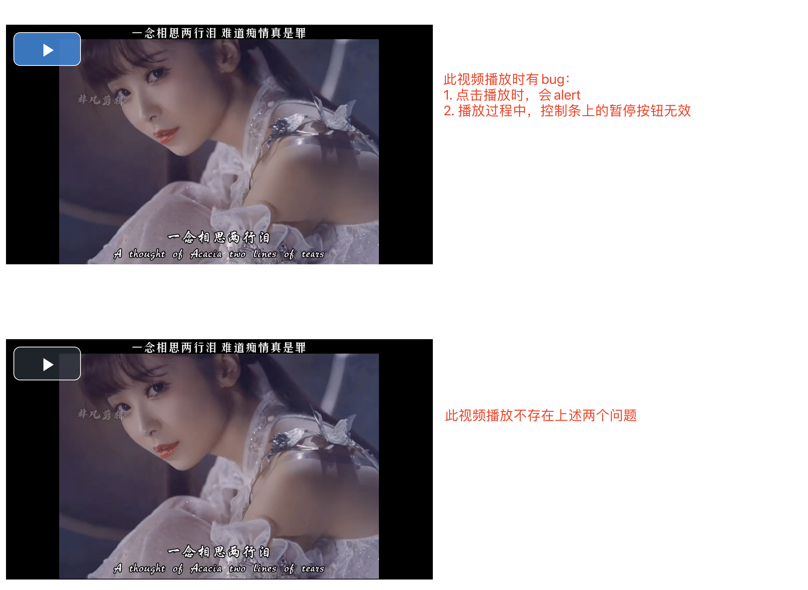

# example-fix-vue-video-player

修复vue-video-player组件在特定场景下的bug的代码示例


详情可见：[详情说明](./src/vue-video-player-modify/readme.md)


## 运行示例

```bash
$ git clone git@github.com:pelligit/example-fix-vue-video-player.git

$ cd example-fix-vue-video-player && npm install

$ npm run serve
```

## 此示例运行效果



## 其他说明

* `vue-video-player-master.zip`是组件`vue-video-player`的源代码
* `src/vue-video-player`目录是将源代码中的`src`目录拷贝过来，然后改名为`vue-video-player`
* `src/vue-video-player-modify`是修改后的组件代码