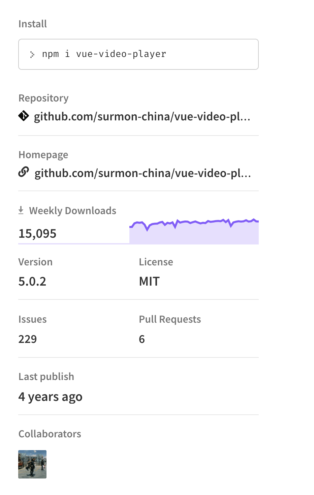

# vue-video-player

改写[vue-video-player](https://www.npmjs.com/package/vue-video-player)，以解决特定场景下出现的问题。

此组件的基本使用方式和[vue-video-player](https://www.npmjs.com/package/vue-video-player)一致，可参照该文档进行使用

## 已知问题

1. 直接使用[vue-video-player](https://www.npmjs.com/package/vue-video-player)时，相应的事件中只能获取到`player`，无法获取到`event`对象，故，在使用时，无法控制事件机制的相关问题
2. 当[vue-video-player](https://www.npmjs.com/package/vue-video-player)和[@vant/touch-emulator](https://www.npmjs.com/package/@vant/touch-emulator)一起使用时，`player`的控制条的部分按钮将会无效，比如`暂停`，`静音`等

## 说明

此组件解决了上述两个问题。

此外，使用时，可监听的事件，默认包括了一些鼠标事件

> 以下是所有可监听的事件

* loadeddata
* canplay
* canplaythrough
* play
* pause
* waiting
* playing
* ended
* error
* click
* mouseup
* mousedown
* mousemove
* touchstart
* touchdown
* touchend

## 目录结构示例

```
|- main.js
|- vue-video-player/
  |- index.js
  |- player.vue
  |- ssr.js
  |- readme.md
  |- custom-theme.css
|- video-player/
  |- test.mp4
  |- videoPlayer.vue
```

## 基本使用示例

`main.js`

```js
import Vue from 'vue';

import VideoPlayer from './vue-video-player';
import './vue-video-player/custom-theme.css';
import 'video.js/dist/video-js.css';

Vue.use(VideoPlayer);
```

`video-player/videoPlayer.vue`

```vue
<template>
  <video-player
    class="video-player vjs-custom-skin"
    :playsinline="true"
    :options="playerOptions"
    @play="onPlayerPlay($event)"
    @click="onPlayerClick($event)"
  ></video-player>
</template>

<script>
import testmp4 from './test.mp4'

export default {
  props: {
    src: {
      type: String
    },
    suffix: {
      type: String,
    },
  },
  data() {
    return {};
  },
  computed: {
    playerOptions: function () {
      let options = {
        playbackRates: [0.7, 1.0, 1.5, 2.0], // 播放速度
        autoplay: false, // 如果true,浏览器准备好时开始回放。
        muted: false, // 默认情况下将会消除任何音频。
        loop: false, // 导致视频一结束就重新开始。
        preload: 'auto', // 建议浏览器在<video>加载元素后是否应该开始下载视频数据。auto浏览器选择最佳行为,立即开始加载视频（如果浏览器支持）
        language: 'zh-CN',
        aspectRatio: '16:16', // 将播放器置于流畅模式，并在计算播放器的动态大小时使用该值。值应该代表一个比例 - 用冒号分隔的两个数字（例如"16:9"或"4:3"）
        fluid: true, // 当true时，Video.js player将拥有流体大小。换句话说，它将按比例缩放以适应其容器。
        sources: [
          {
            type: 'video/mp4', // 这里的种类支持很多种：基本视频格式、直播、流媒体等，具体可以参看git网址项目
            src: testmp4
          }
        ],
        poster: '', // 你的封面地址
        width: document.documentElement.clientWidth, // 播放器宽度
        height: '100%',
        notSupportedMessage: '此视频暂无法播放，请稍后再试' // 允许覆盖Video.js无法播放媒体源时显示的默认信息。
      };

      return options;
    }
  },
  methods: {
    onPlayerPlay(event) {

    },
    onPlayerClick(event){
      event.nativeEvent.stopPropagation();
    },
  }
};
</script>
```


## 获取原生事件

```js
onPlayerClick(event){
  const nativeEvent = event.nativeEvent;

  nativeEvent.stopPropagation();

  nativeEvent.preventDefault();
}
```

## 相关项目NPM主页链接

* [vue-video-player](https://www.npmjs.com/package/vue-video-player)
* [video.js](https://docs.videojs.com/)
* [@vant/touch-emulator](https://www.npmjs.com/package/@vant/touch-emulator)


`vue-video-player-master.zip`是源码的备份。

下面是`NPM`主页关于此库的基本信息的截图


